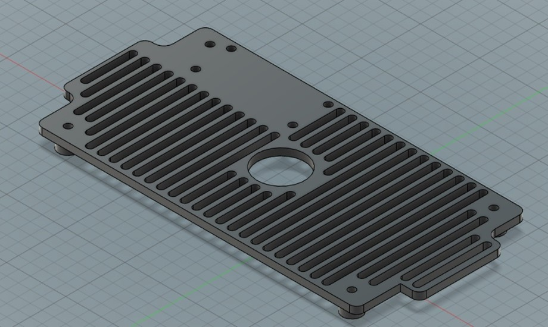
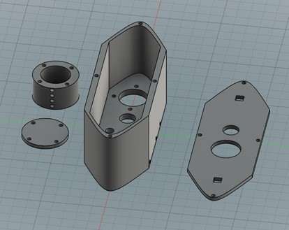
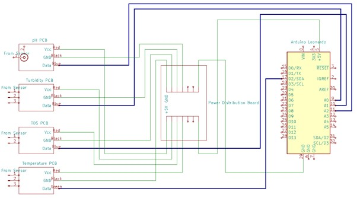
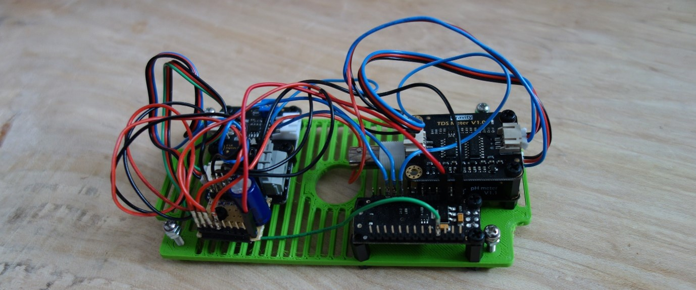
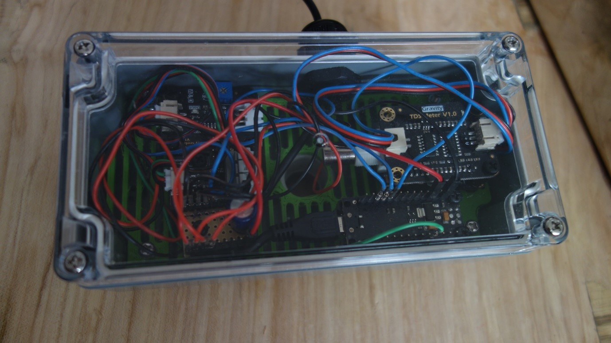
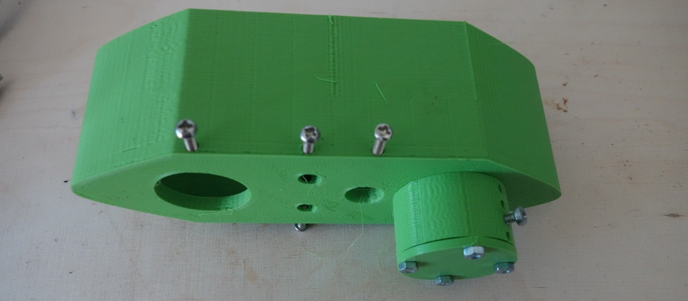
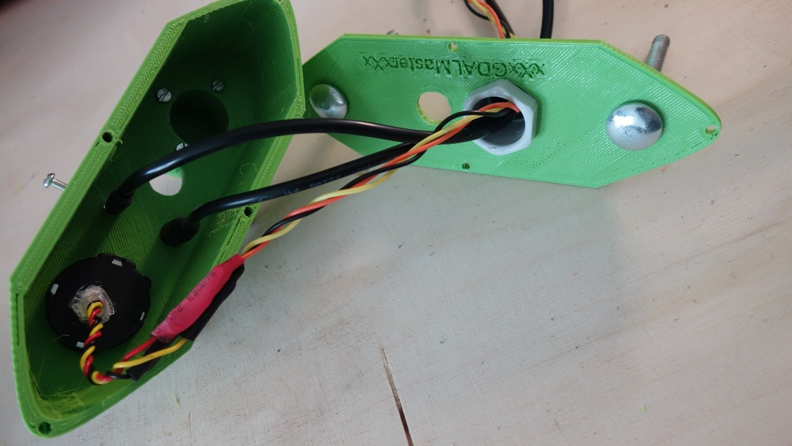

```{r setup, include = FALSE}
library("papaja")
r_refs("r-references.bib")
```

# Theory of operation
The sensor array is created to measure in-situ water quality across four parameters. The  sensors are small in size and inexpensive, and can therefore be fitted on a USV or UAV. 
The sensors are physically separated from the electronics by being in a different housing, this ensures that they can always be in direct contact with the water. The Arduino code currently only sends the sensor information over serial, to be used in a broader system, such as a system running on the Robotics Operating System. However, other implementations such as directly storing to a SD card can be easily implemented in the code. Upgradability is available for the software, as the current scripts do not use the full computing power and storage of the Arduino Leonardo. Upgradability of sensor hardware is currently not possible as the housing is made to be as small as possible and fit the sensors exactly, to ensure water resistance. There is a mounting system for a small echosounder, made by KoggerTech, as this might be implemented later in the project.

\newpage

# Hardware
The hardware is mounted in such a way to protect the components from potential water damage. Also, it needs to be able to have reliable connection to the hull, as well as be able to change monitoring platforms. The sensors all require direct contact with the water, which means two things. First, the sensors should be mounted on a system that can be submerged, or withstand water, the sensors themselves also should be waterproof. Second, the electronics and processing should be done in a separate box, to prevent water entering and interfering with the electronics. This means that two sub-systems make up the sensor-array: a Sensor Box as well as an Electronics Box.
The Electronics Box is an off-the-shelve electronics box with an IP67 rating. To facilitate the various electronics-boards, an extra mounting surface was designed and 3D-printed. On this surface, the 4 different sensor-processing boards are placed, as well as the central processing board, a DFRobot Nano, which is a smaller version of the Arduino Leonardo, a small, programmable microcontroller. Power is delivered via the USB port, distributed via a simple distribution board with a 1000uF capacitor to eliminate noise. All connections are made with simple pin-header cables, secured with additional hot-glue.

```{r platform-cad,fig.pos='!h', fig.cap = "(ref:platform-cad-caption)", out.extra='', out.width="\\textwidth"}


```

(ref:platform-cad-caption) CAD of the electronics platform

The Sensor Box is a 3D-printed enclosure with holes to fit all the sensors. Important here is the following: the ability to secure the sensors; make sure as little as water as possible enters the enclosure; create a mounting system that can be used on a variety of platforms; connect the sensors to the electronics. With this in mind, a boat-shaped box was created in a CAD environment (Fusion 360), with the proper holes in the bottom to fit all the sensors, as well as side-mounted screw-holes to make sure the sensors stay in place. The lid has holes to ensure the passthrough of the longer pH sensor and the wires. It has square holes to accommodate M6 threaded nuts and bolts for mounting.

```{r sensor-box-cad,fig.pos='!h', fig.cap = "(ref:sensor-box-cad-caption)", out.extra='', out.width="\\textwidth"}


```

(ref:sensor-box-cad-caption) CAD of the Sensor Box

\newpage

## Parts
```{r table1, out.extra='',fig.pos='H'}
library("readxl")

t1 <- read_excel(path="sup/wishlist.xlsx", sheet = "sensors")
apa_table(
  t1
  , caption = "Sensors of the Sensor Array.", placement = "H"

)
```

```{r table2,fig.pos='H', out.extra=''}
library("readxl")

t2 <- read_excel(path="sup/wishlist.xlsx", sheet = "enclosure")
apa_table(
  t2
   , caption = "Enclosure parts of the Sensor Array.", placement = "H"

)
```

```{r table3,fig.pos='H', out.extra=''}
library("readxl")

t3 <- read_excel(path="sup/wishlist.xlsx", sheet = "additional")
apa_table(
  t3
   , caption = "Additional parts of the Sensor Array.", placement = "H"

)

```

\newpage

## Assembly

```{r wiring,fig.pos='H', fig.cap = "(ref:wiring-caption)", out.extra='', out.width="\\textwidth"}


```

(ref:wiring-caption) Wiring diagram in the Electronics Box

The overall assembly is straightforward. The housings are assembled with M3 screws. The PCBs are connected to the Arduino Leonardo according to: \@ref(fig:wiring). The Arduino communicates via a serial connection over the USB port.


### Electronics Box
The Electronics Box consists of the waterproof box and the mounting platform. The PCBs are laid out on the platform, in a somewhat efficient manner (\@ref(fig:platform-photo)), mounted via M3 standoffs. With the easy access, the wires are connected according to: \@ref(fig:wiring).

```{r platform-photo,fig.pos='H', fig.cap = "(ref:platform-photo-caption)", out.extra='', out.width="\\textwidth"}


```

(ref:platform-photo-caption) Electronics Platform

The platform can now be placed in the box. With the platform in place, screw the platform down in the four corners, ensuring it is firmly secured in the box ((\@ref(fig:electro-box)). The USB cable can now be connected to the Arduino and routed through the side-hole to an external processing system.

```{r electro-box,fig.pos='H', fig.cap = "(ref:electro-box-caption)", out.extra='', out.width="\\textwidth"}


```

(ref:electro-box-caption) Closed Electronics Box

The cabling from the Sensor Box can also be connected to the corresponding PCBs, according to: \@ref(fig:wiring). The cables are routed through the hole in the bottom of the box and platform. Both the USB and sensor holes have an additional waterproofing with cable gromets.

### Sensor Box
The Sensor Box consists of the hull, lid, sonar mount and sonar lid. All can be joined with M3 screws. Four 40mm M3 bolts are pushed through the bottom of the hull, where the sonar mount fits. The sonar mount is connected to these bolts, and the lid is joined to the mount with four M3 nuts. Furthermore, the sensor set screws can be screwed into the corresponding holes, making sure not to close the holes through which the sensors fit.

```{r sensor-box-photo,fig.pos='H', fig.cap = "(ref:sensor-box-photo-caption)", out.extra='', out.width="\\textwidth"}


```

(ref:sensor-box-photo-caption) Empty Sensor Box

The box is now ready to fit the Turbidity, TDS, and Temperature sensor. The Turbidity fits in the largest hole. With the Turbidity sensor facing north, the left hole is for the TDS sensor, and the temperature on the right.  Set the sensors in place by lightly tightening the set screws, until the sensors do not twist anymore. The cables of these sensors can be routed through the gromet at the top of the lid ((\@ref(fig:sensor-box-photo2)). The lid in this picture already has the gromet and two bolts mounted.

```{r sensor-box-photo2,fig.pos='H', fig.cap = "(ref:sensor-box-photo2-caption)", out.extra='', out.width="\\textwidth"}


```

(ref:sensor-box-photo2-caption) Sensor Box and Lid

The lid can now be closed by screwing in the four 20mm M3 bolts, note the correspondence of the two pH holes. The pH sensor is added by removing the cap of the probe and pushing it through the two holes, until the point of the probe is of similar depth to the other sensors. The cap can be placed back, to ensure longevity of the pH probe. 
The sonar can be added by removing the sonar lid, pushing it in from the bottom, ensuring that the sonar can be completely submerged. Place the sonar in the correct place and tighten the set screw. Finally, the nuts should be screwed on the protruding bolts. The sonar cable can now also be routed through the gromet. The sonar works best without the lid, so keep the lid safe until the mission is complete. 
All the cables can now be connected to the electronics in the other box.

\newpage

# Software

## Functionality
The purpose of the sensor array is to measure the water quality of a pond whilst mounted on a USV. The hardware ensures that the sensors are in good, reliable, and repeatable contact with the water. They do not do anything yet. They are connected to an Arduino Leonardo which needs to be programmed to read the sensor values and publish them over a serial USB connection.
## Arduino Code
There are at least a dozen ways to approach the concept of an Arduino reading values and pushing them over the serial port to another machine, all in varying complexity. The simplest way is to directly sense the analog voltage every second and sending that to the USB port. However, noise is easily created by wiggling the cables, or other effects which only last a very short moment. 
An Arduino is powerful enough for light on-board processing. The implementation here takes an analog voltage reading and converts it to the correct sensed value (pH, NTU, Celsius, etc.), according to the principals to which these sensors function. It does this every 0.04 seconds and places the values in an array. The mean value of this array is taken every 0.8 seconds and sent over the serial connection.
A few additional libraries have been used to make this work. The OneWire library, which has been specifically created to communicate with the Temperature probe. The probe uses the OneWire technology to send digital information over a single wire.
The company which sells the sensors used in this project have also created a library specifically for the TDS sensor. Which was directly implemented according to their sample code.
The creatd Arduino package can be found on the Github Repository of the thesis. Below are a few important highlights for the code.

\newpage

```{c Arduino 1, echo=TRUE, eval = FALSE}

//Temperature sampling, temperature is also used in TDS adjustment
temperature = getTemp();  

//TDS sampling
gravityTds.setTemperature(temperature);  
gravityTds.update();  //sample and calculate
tdsValue = gravityTds.getTdsValue();  // then get the value

//Turbidity sampling
int turbValue = analogRead(TurbPin);
float turbVoltage = turbValue * (5.0/1024.0);     

//pH Sampling
int phSensorValue = analogRead(PhPin);
float phVoltage = phSensorValue * (5.0/1024.0);
float phValue = 3.5*phVoltage + Offset;

```

```{r cap1 ,fig.pos='H', fig.cap = "(ref:caption)", out.extra='', out.width="\\textwidth"}


```
(ref:caption) Code Snippet: Acquiring sensor values  


The sensors all acquire their data slightly differently. The above snippet occurs every 0.04 seconds. For the temperature probe, the function getTemp() is used, which reads the actual temperature, as signalled over the digital connection to the Arduino and converts it from hexadecimal to a temperature reading. The TDS library from DFRobot has a built-in function which samples, and adjusts the acquired value for the temperature of the water, which has been measured above, as TDS is sensitive to temperature.

The turbidity voltage is read from the analog pin and converted from the 10-bit integer to a 5v reading. During the writing of this script, the linear values of the conversion from voltage to NTU was not yet known and therefore not implemented yet. DFRobot and an academic paper [@Hakim2019]  disagree over the exact values. The pH has a similar situation, in this case however, the sampled values are converted to pH values by taking the example code from DFRobot. This means that the exact linear relation of the turbidity and pH voltages to their corresponding values still needs to be calibrated.

```{c Arduino 2, echo=TRUE, eval = FALSE}

//Temperature filtering and printing
medianTemp = getMedianNum(analogBufferTemp, SCOUNT);

Serial.print("Temperature: ");
Serial.print(medianTemp);
Serial.print(" Celsius; ");

```

```{r cap2 ,fig.pos='H', fig.cap = "(ref:caption2)", out.extra='', out.width="\\textwidth"}


```
(ref:caption2) Code Snippet: Median Filtering sensor values and sending over serial


The code snippet above is the same for all the sensors and occurs every 0.8 seconds. First, it filters the temperature array of 20 sampled values, by taking the median (middle value in an ordered array). With this filtered value, it prints it over the serial connection, by formatting it as “Temperature: xx Celsius;”. This is repeated for all the sensors, with the correct formatting. This will make it easy to read with another program, on another system, if the Arduino is connected over the USB port. 

The Kogger Sonar sensor has not yet arrived, but uses an I2C or serial connection to communicate, as it has a powerful processing system onboard the sonar itself, dealing with the gyroscope and transducer all at once. It can therefore be used in a variety of implementations: from directly communicating with a central processing system running ROS, or via the Arduino in a similar fashion to the sensors above. As the sonar is more robust and expensive than the water quality sensors, the only limiting factor is the sampling rate, as each observation is reliable; not requiring a median filter. According to the datasheet a depth sample can be made every 0.5 seconds, limited by the speed of sound in water.

\newpage

# References

\begingroup
\setlength{\parindent}{-0.5in}
\setlength{\leftskip}{0.5in}

<div id="refs" custom-style="Bibliography"></div>
\endgroup
